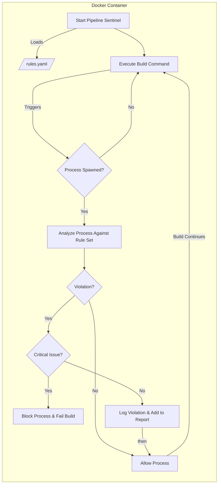

# Pipeline Sentinel

**A lightweight, eBPF-powered security monitor for CI/CD build pipelines.**

**[Read the Full Research Paper](./docs/Pipeline_Sentinel_Research_Paper.pdf)**

[](https://github.com/appsec-jedi/pipeline-sentinel/actions)
[](https://opensource.org/licenses/MIT)

Pipeline Sentinel provides real-time visibility into the build phase of CI/CD pipelines, detecting and blocking suspicious process executions to protect against supply chain attacks.

## The Problem: The CI/CD Blind Spot

Modern CI/CD pipelines are a prime target for attackers. The build step often pulls and executes code from dozens of third-party dependencies, creating a significant but often unmonitored attack surface. Malicious packages or compromised build tools can execute arbitrary commands inside your trusted environment to steal secrets, inject backdoors, or pivot to other internal systems.

Traditional security tools like SAST and artifact scanning analyze your code *before* or *after* the build, leaving the build phase itself a critical blind spot.

## The Solution: Real-time Behavioral Monitoring

Pipeline Sentinel addresses this gap by monitoring the build environment in real-time. It uses modern kernel technology to watch every process as it's created, matching its behavior against a flexible rule set to identify threats.

### Key Features

* **Kernel-Level Visibility via eBPF:** Uses eBPF to safely and efficiently monitor all new process executions (`execve` syscall) with near-zero performance overhead.
* **Intelligent Analysis in Go:** A high-performance Go agent enriches kernel events with full command-line arguments and applies custom detection logic.
* **Flexible YAML Rule Engine:** Detections are driven by a simple `rules.yaml` file, allowing users to easily define suspicious patterns, from single commands to complex, multi-part command strings.
* **CI/CD Integration:** Fully containerized with Docker and designed to run as a service container in pipelines like GitHub Actions, with the ability to automatically fail a build when a critical threat is found.

## Architecture

The tool is composed of two main components:

1. **eBPF Probe (C):** A minimal, safe program that runs in the Linux kernel to capture process events.
2. **User-space Agent (Go):** A concurrent Go application that receives events from the kernel, reads the full command line from `/proc`, matches events against the rule set, and generates alerts.



### Getting Started

## Prerequisites

* Go (1.23+)
* Docker
* clang, llvm, libbpf-dev, make, bpftool

## Local Build & Run

1. Build the application: `make build`
2. Build the Docker image: `docker build -t pipeline-sentinel-app .`
3. Run the container: This command runs the sentinel and mounts your local rules.yaml and a reports directory into the container.

``` bash
# Create the reports directory first
mkdir -p reports

# Run the container
sudo docker run -it --rm \
  --name sentinel-container \
  --cap-add=SYS_ADMIN \
  --pid=host \
  -v /sys/kernel/debug:/sys/kernel/debug:ro \
  -v ${PWD}/rules.yaml:/app/rules.yaml:ro \
  -v ${PWD}/reports:/app/reports \
  pipeline-sentinel-app
```

## Configuration (`rules.yaml`)

The detection logic is controlled by the `rules.yaml` file. The engine uses "smart" matching based on the number of items in the `match_all` list.

* Single-Item List: Triggers a precise "whole word" match. Ideal for single commands.
* Multi-Item List: Triggers a "contains all substrings" match. Ideal for complex patterns.

``` yaml
# rules.yaml

# This rule uses "whole word" matching and will trigger on 'whoami'
# but not on commands that simply contain the substring 'whoami'.
- id: recon_whoami
  description: "Detects 'whoami' used for user discovery"
  severity: "medium"
  match_all: 
    - "whoami"

# This rule uses "contains all" matching and will trigger on any
# command that contains "curl", "|", and "bash".
- id: curl_remote_script_execution
  description: "Detects downloading a remote script and executing it with a shell"
  severity: "critical"
  match_all:
    - "curl"
    - "|"
    - "bash"
```

## Usage in GitHub Actions

Pipeline Sentinel is designed to run as a service container in a CI/CD pipeline. The following is a two-job workflow that builds the tool and then uses it to monitor a test script.

Place this file in '''.github/workflows/sentinel-test.yml''':

``` yaml
name: Pipeline Sentinel CI

on: [push]

jobs:
  build:
    runs-on: ubuntu-latest
    permissions:
      contents: read
      packages: write
    steps:
      - name: Check out repository
        uses: actions/checkout@v4
      - name: Log in to the GitHub Container Registry
        uses: docker/login-action@v3
        with:
          registry: ghcr.io
          username: ${{ github.actor }}
          password: ${{ secrets.GITHUB_TOKEN }}
      - name: Build and push Docker image
        run: |
          IMAGE_ID=ghcr.io/${{ github.repository }}:${{ github.sha }}
          docker build -t $IMAGE_ID .
          docker push $IMAGE_ID

  test-with-sentinel:
    needs: build
    runs-on: ubuntu-latest
    services:
      sentinel:
        id: sentinel
        image: ghcr.io/${{ github.repository }}:${{ github.sha }}
        credentials:
          username: ${{ github.actor }}
          password: ${{ secrets.GITHUB_TOKEN }}
        options: >-
          --pid=host
          --cap-add=SYS_ADMIN
          -v /sys/kernel/debug:/sys/kernel/debug:ro
    steps:
      - name: Check out repository
        uses: actions/checkout@v4
      - name: Run Fake Build Script for Testing
        run: |
          chmod +x ./fake_build_script.sh
          ./fake_build_script.sh || true
      - name: Check Sentinel Logs and Finalize
        if: always()
        run: |
          echo "--- Final Sentinel Logs ---"
          docker logs sentinel > sentinel-log.txt 2>&1
          cat sentinel-log.txt
          echo "--- Checking for Critical Alerts ---"
          if grep -q "CRITICAL" sentinel-log.txt; then
            echo "Build FAILED due to critical alert found in logs."
            exit 1
          else
            echo "Build successful. No critical alerts found."
          fi
      - name: Upload Sentinel Log as Artifact
        if: always()
        uses: actions/upload-artifact@v4
        with:
          name: sentinel-log-report
          path: sentinel-log.txt
```

## Future Work

* Output alerts in structured JSON format for easier machine parsing.
* Expand eBPF probes to monitor other syscalls (e.g., connect for network, open for files).
* Enhance the rule engine to support more advanced context (e.g., parent process matching).
* Add a main configuration file for the tool itself.

## Contributing

Contributions are welcome! Please feel free to open an issue or submit a pull request.

## License

This project is licensed under the MIT License.
